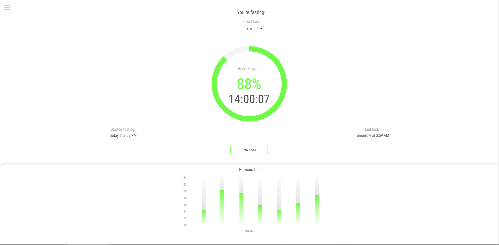
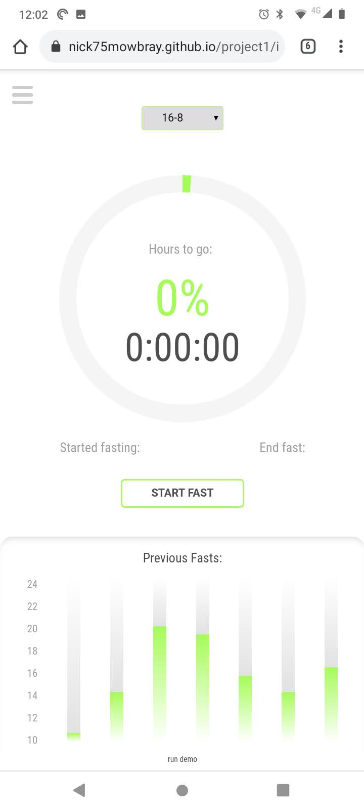
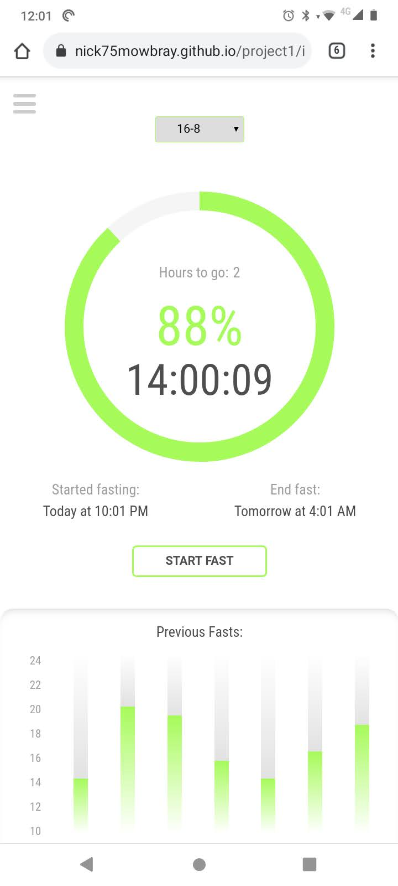
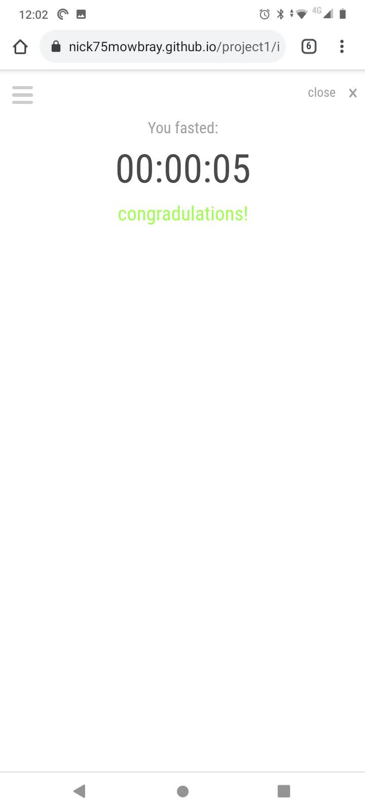
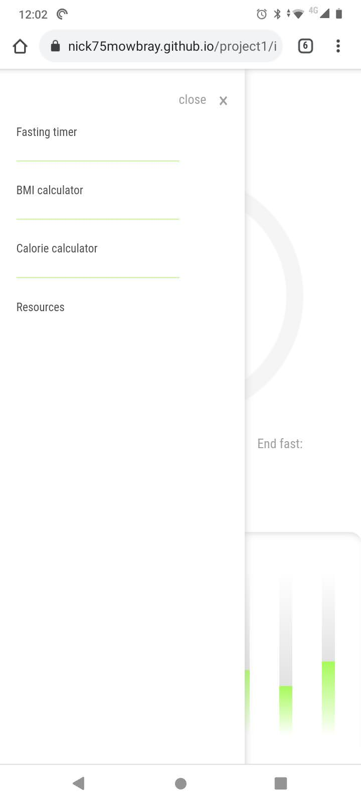
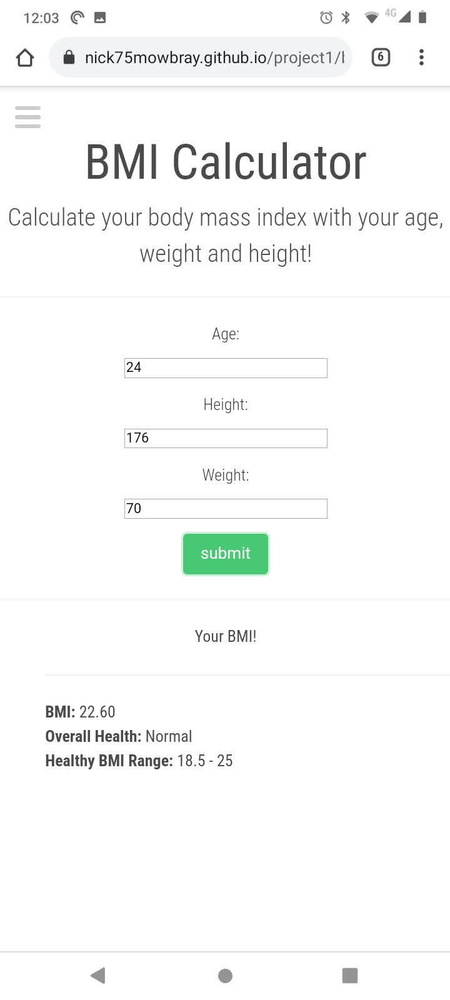
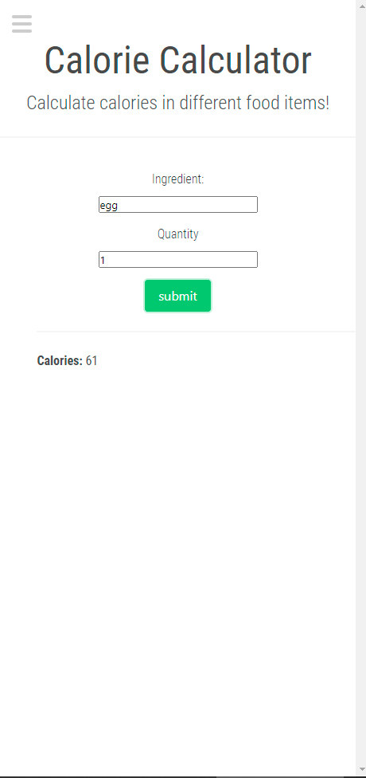
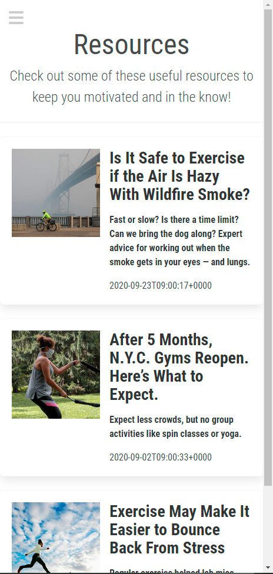

# fasting timer
[Click here to got to site](https://nick75mowbray.github.io/project1/)
## Overview/ features:
This is an intermittent fasting application designed to help users to keep track of when to eat and when to fast. It also contains useful information and calculators including a BMI and calorie calculator as well as links to useful articles.

# Timer:
The user can select the type of fast they wish to do choosing a 16, 18, or 20hr fast.\
When the user presses the start button they will be presented with the start and end time of the fast. The start and end time is then sent to local storage so that the timer continues to function when the user leaves or refreshes the site.\
The timer uses moment.js to get the start time, end time (start time .add()) and the current time which is used to calculate the digits of the timer and the hours remaining.\
The circle display of the timer is created using html/css and the progress is updated by changing the class of the object in js. credit to (https://tiagobalmeida.github.io/posts/making-a-pure-css-circular-progress-bar.html) for the stylesheet, which was then edited to give the desired styling.\
The percentage of the timer is calculated by converting the time remaining in the fast to hours and minutes and converting the minutes to metric minutes (100 mins in hr) and combining the two values.\
When a user ends a fast they are presented with their time and the fasting time is stored in local storage and rendered to the page as a graph.
# Previous fasts graph:
The users previous fast are stored in local storage as an array, that data is then used to render a bar graph to the page. The height of the bars is determined by calculating pixel height of the values representing the number of hours fasted.
# BMI calculator:
# Calorie calculator:
# Resources page:
# Screenshots:

